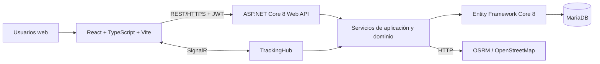

# AppDelivery

Plataforma web responsive de delivery que conecta a **clientes**, **comercios** y **repartidores** en un mismo MVP. El sistema permite administrar cuentas, catálogos, carrito, pedidos, pagos simulados, asignaciones logísticas, rutas y seguimiento en tiempo real.

> Estado del proyecto: MVP web funcional. La aplicación móvil nativa, el cobro bancario real y el despliegue productivo automatizado se mantienen fuera del alcance actual.

## Funcionalidades principales

### Cliente

- Registro, inicio de sesión, recuperación de contraseña y renovación de sesión.
- Exploración y búsqueda de comercios y productos.
- Carrito persistente, direcciones y métodos de pago enmascarados.
- Checkout, historial, cancelación y seguimiento de pedidos.
- Mapa de ruta y actualización del pedido mediante SignalR.

### Comercio

- Registro y edición del comercio.
- Administración de categorías, productos, precios, disponibilidad e inventario.
- Recepción de pedidos y avance de estados operativos.
- Resumen de pedidos y ventas.

### Repartidor

- Registro, perfil, vehículo, disponibilidad y ubicación GPS.
- Recomendación y aceptación de entregas.
- Ruta hacia el comercio y el cliente mediante OSRM/OpenStreetMap.
- Actualización de estados, historial y resumen de actividad.

## Arquitectura resumida



La solución utiliza un **monolito modular en un monorepo**. El backend separa contratos, controladores, servicios, infraestructura, autorización, middleware, modelos y persistencia. El frontend separa páginas por rol, componentes, contextos, servicios API y tipos.

## Stack tecnológico

| Capa | Tecnologías |
|---|---|
| Frontend | React 19, TypeScript 6, Vite 8, Tailwind CSS 4, React Router 7, Leaflet, SignalR |
| Backend | C# 12, ASP.NET Core 8, Entity Framework Core 8, Swagger/OpenAPI |
| Base de datos | MariaDB 12 con migraciones de EF Core |
| Tiempo real y mapas | SignalR, OSRM y mosaicos de OpenStreetMap |
| Pruebas | xUnit, ASP.NET Core MVC Testing, EF Core InMemory, Coverlet |
| Calidad y control | oxlint, Git, GitHub, Pull Requests y GitHub Actions |

Las versiones exactas y su justificación están en [`docs/03-stack-tecnologico.md`](docs/03-stack-tecnologico.md).

## Inicio rápido

### Requisitos

- Git
- .NET SDK 8
- Node.js 20 o superior
- npm
- MariaDB 12

### 1. Restaurar herramientas y dependencias

```bash
git clone https://github.com/CJ-REYES/AppDelivery.git
cd AppDelivery

dotnet tool restore
dotnet restore Backend/Backend.csproj
npm --prefix Frontend ci
```

### 2. Configurar secretos del backend

```bash
dotnet user-secrets set \
  "ConnectionStrings:DefaultConnection" \
  "Server=127.0.0.1;Port=3306;Database=appdelivery;User ID=appdelivery;Password=TU_PASSWORD;" \
  --project Backend/Backend.csproj

dotnet user-secrets set \
  "Jwt:Key" \
  "UNA_LLAVE_ALEATORIA_DE_AL_MENOS_32_BYTES" \
  --project Backend/Backend.csproj
```

### 3. Configurar el frontend y aplicar migraciones

```bash
cp Frontend/.env.example Frontend/.env.local

dotnet ef database update \
  --project Backend/Backend.csproj \
  --startup-project Backend/Backend.csproj \
  --context AppDbContext
```

### 4. Ejecutar

Terminal 1:

```bash
dotnet run --project Backend/Backend.csproj --launch-profile http
```

Terminal 2:

```bash
npm --prefix Frontend run dev
```

Por defecto, el frontend usa `http://localhost:5173` y la API `http://localhost:5258/api`.

## Validación

```bash
dotnet build Backend/Backend.csproj
dotnet test Backend.Tests/Backend.Tests.csproj --collect:"XPlat Code Coverage"
npm --prefix Frontend run lint
npm --prefix Frontend run build
```

El repositorio contiene **19 pruebas automatizadas de integración del backend**. El pipeline de GitHub Actions repite restore, build, test, lint y build en cada Pull Request hacia `develop` o `main`.

## Documentación

| Documento | Contenido |
|---|---|
| [`docs/00-indice.md`](docs/00-indice.md) | Índice general y relación con la rúbrica |
| [`docs/01-metodologia.md`](docs/01-metodologia.md) | Scrum, sprints, entregables y evidencias |
| [`docs/02-arquitectura.md`](docs/02-arquitectura.md) | Diagramas, componentes, responsabilidades y comunicación |
| [`docs/03-stack-tecnologico.md`](docs/03-stack-tecnologico.md) | Tecnologías, versiones y justificación |
| [`docs/04-flujo-git.md`](docs/04-flujo-git.md) | Git Flow, commits, PR y estrategia de integración |
| [`docs/05-trazabilidad.md`](docs/05-trazabilidad.md) | Requisitos, código, pruebas y Pull Requests |
| [`docs/06-instalacion-configuracion.md`](docs/06-instalacion-configuracion.md) | Instalación, variables, migraciones y ejecución |
| [`docs/07-manual-usuario.md`](docs/07-manual-usuario.md) | Flujos de cliente, comercio y repartidor |
| [`docs/08-pruebas-calidad.md`](docs/08-pruebas-calidad.md) | Estrategia de pruebas, CI y criterios de aceptación |
| [`docs/09-consistencia-alcance.md`](docs/09-consistencia-alcance.md) | Diferencias entre propuesta inicial e implementación real |
| [`docs/10-lista-verificacion-rubrica.md`](docs/10-lista-verificacion-rubrica.md) | Evidencia para cada criterio de evaluación |
| [`Backend/README.md`](Backend/README.md) | API, endpoints, seguridad y base de datos |
| [`Frontend/README.md`](Frontend/README.md) | Rutas, configuración y comportamiento de la SPA |

## Git Flow

```text
feature/* ──Pull Request──> develop ──Pull Request de release──> main
```

- `main`: versiones estables y entregables.
- `develop`: integración de los sprints.
- `feature/*`, `fix/*`, `test/*`, `docs/*` y `chore/*`: trabajo aislado.
- No se realizan cambios directos en `main`.

Consulta [`CONTRIBUTING.md`](CONTRIBUTING.md) y [`docs/04-flujo-git.md`](docs/04-flujo-git.md).

## Alcance y limitaciones

El estado real del repositorio es una **plataforma web responsive**. Los pagos se registran de forma simulada y segura, pero no se ejecuta un cargo real con Stripe o Mercado Pago. No existe aplicación React Native, publicación en tiendas ni infraestructura productiva en Railway/Supabase. Estas diferencias frente a la propuesta inicial están documentadas de forma explícita para asegurar consistencia entre documentación y código.

## Autor

**Carlos Jose Suchite Reyes**

Universidad Tecnológica de Candelaria - Desarrollo Web Integral, mayo-agosto 2026.
