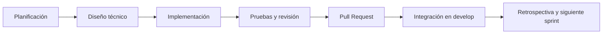

# Metodología de desarrollo

## 1. Marco de trabajo

AppDelivery se desarrolló mediante **Scrum adaptado a un proyecto individual**, con entregas incrementales organizadas en seis sprints. La propuesta inicial definió ciclos de dos semanas; durante la ejecución académica, el trabajo se mantuvo incremental y cada incremento se aisló en ramas de Git, se validó y se integró mediante Pull Requests.

Aunque una sola persona asumió varios roles, se conservaron las responsabilidades esenciales:

| Rol Scrum adaptado | Responsabilidad en el proyecto |
|---|---|
| Product Owner | Priorizar el happy path del MVP y aceptar el alcance de cada entrega |
| Scrum Master | Mantener el flujo de trabajo, remover bloqueos y asegurar la disciplina de Git Flow |
| Development Team | Diseñar, programar, probar, documentar e integrar backend y frontend |

## 2. Fases aplicadas en cada sprint

### Planificación

- Selección del objetivo funcional.
- Delimitación del alcance y de lo que quedaba fuera.
- Definición de rama, commits esperados y criterios de aceptación.

### Diseño técnico

- Identificación de páginas, contratos, endpoints, modelos y servicios afectados.
- Revisión de consistencia con la arquitectura modular.
- Definición de migraciones cuando existían cambios persistentes.

### Implementación

- Backend y frontend se desarrollaron en el mismo monorepo, pero en carpetas separadas.
- Las funcionalidades se dividieron en commits semánticos y revisables.

### Pruebas y revisión

- Backend: `dotnet build` y `dotnet test`.
- Frontend: `npm run lint` y `npm run build`.
- Git: `git diff --check`, revisión de archivos y estado de la rama.

### Integración

- La rama de trabajo generó un Pull Request hacia `develop`.
- Las entregas estables se publicaron mediante Pull Request de `develop` hacia `main`.

## 3. Plan real de sprints

| Sprint | Objetivo y entregables reales | Evidencia |
|---|---|---|
| Sprint 1 | Monorepo, base visual, landing y acceso público | PR #1, #2 y release #3 |
| Sprint 2 | Exploración de comercios, productos, carrito, checkout, pedidos y seguimiento inicial | PR #4 y #5 |
| Sprint 3 | Esquema MariaDB, migraciones, autenticación JWT, roles, perfil y direcciones | PR #6, release #7 y PR #8 |
| Sprint 4 | Catálogo real del comercio, inventario, pedidos y pagos simulados | PR #9 y #10 |
| Sprint 5 | Repartidores, asignaciones, rutas, GPS, SignalR y tracking | PR #11 |
| Sprint 6 | Estabilización final, CI, documentación, trazabilidad y preparación de release | Rama y PR final de SPRINT6 |

## 4. Entregables

- Código fuente del backend y frontend.
- Migraciones de Entity Framework Core.
- Suite de 19 pruebas automatizadas del backend.
- Pipeline de GitHub Actions.
- Documentación técnica, funcional y de Git Flow.
- Evidencia de Pull Requests e integración por sprint.
- Release final de `develop` hacia `main`.

## 5. Evidencia de seguimiento

La evidencia se encuentra en:

- Historial de commits con convenciones semánticas.
- Pull Requests #1 a #11.
- Descripciones de PR con objetivo, cambios, validación y fuera de alcance.
- Pruebas en `Backend.Tests/`.
- Archivo `.github/workflows/ci.yml`.
- Tabla de trazabilidad en `05-trazabilidad.md`.

## 6. Criterio de terminado

Una historia o módulo se considera terminado cuando:

1. La funcionalidad está conectada al flujo real.
2. No se incluyen secretos ni artefactos generados.
3. Backend compila y las pruebas pasan.
4. Frontend supera lint y build.
5. La documentación refleja el comportamiento real.
6. Los cambios se integran mediante Pull Request.
