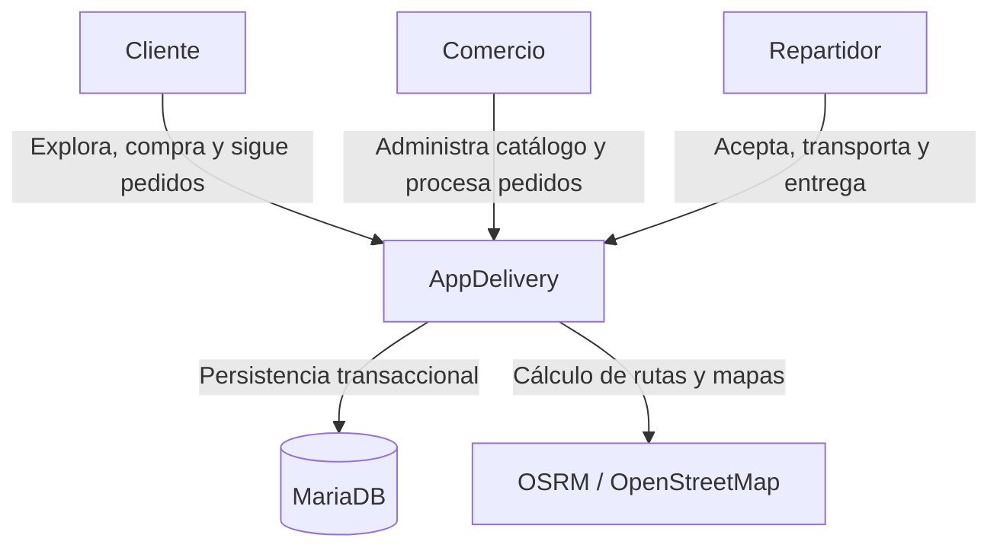
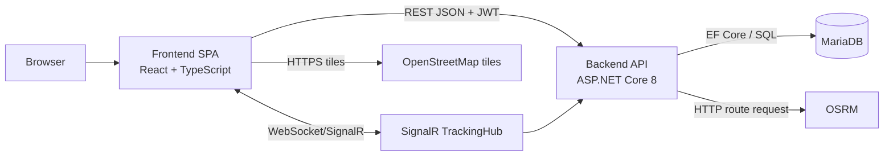
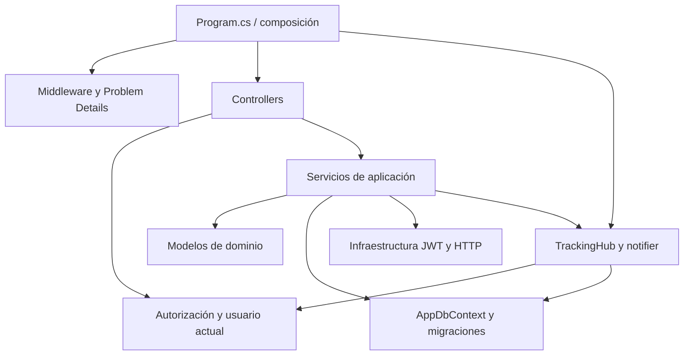
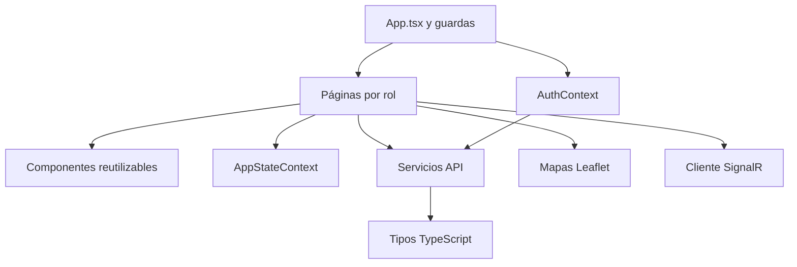
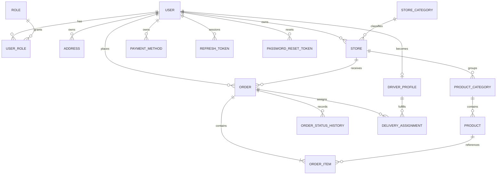
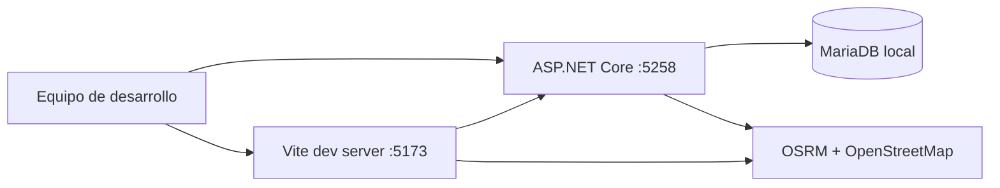

# Arquitectura del sistema

## 1. Estilo arquitectónico

AppDelivery utiliza un **monolito modular** dentro de un monorepo. El backend es una única API desplegable, pero está dividido por responsabilidades y dominios. El frontend es una SPA web responsive organizada por roles y módulos funcionales.

Este enfoque reduce la complejidad operativa de microservicios y mantiene fronteras claras para autenticación, catálogo, pedidos, pagos, repartidores y seguimiento.

## 2. Diagrama de contexto

## 3. Diagrama de contenedores

## 4. Componentes del backend

| Componente | Responsabilidad | Ubicación |
|---|---|---|
| Composición | Configura DI, JWT, CORS, Swagger, SignalR y pipeline HTTP | `Backend/Program.cs` |
| Controladores | Expone endpoints REST y aplica políticas de autorización | `Backend/Controllers/` |
| Servicios | Ejecuta reglas de negocio y transacciones | `Backend/Services/` |
| Autorización | Obtiene identidad y roles del usuario autenticado | `Backend/Authorization/` |
| Infraestructura Auth | Emite y valida JWT, genera tokens seguros | `Backend/Infrastructure/Auth/` |
| Middleware | Convierte errores en Problem Details consistentes | `Backend/Middleware/` |
| Persistencia | Mapea entidades y ejecuta migraciones | `Backend/Data/` |
| Dominio | Representa usuarios, comercios, pedidos y entregas | `Backend/Models/` |
| Tiempo real | Autoriza suscripciones y notifica cambios por pedido | `Backend/Hubs/` y servicios de Deliveries |

## 5. Componentes del frontend

| Componente | Responsabilidad | Ubicación |
|---|---|---|
| Rutas y guardas | Navegación, autenticación y acceso por rol | `Frontend/src/App.tsx` |
| Contexto de autenticación | Sesión, refresh programado, logout y sincronización de roles | `Frontend/src/context/AuthContext.tsx` |
| Estado de aplicación | Carrito y estado compartido del cliente | `Frontend/src/context/AppStateContext.tsx` |
| Páginas | Experiencia de cliente, comercio, repartidor y páginas públicas | `Frontend/src/pages/` |
| Servicios API | Peticiones tipadas hacia cada módulo del backend | `Frontend/src/services/` |
| Cliente HTTP | URL base, JWT, cookies y manejo uniforme de errores | `Frontend/src/lib/api.ts` |
| Componentes | Formularios, tarjetas, layouts, mapas y elementos comunes | `Frontend/src/components/` |
| Tipos | Contratos usados por la interfaz | `Frontend/src/types/` |

## 6. Comunicación entre módulos

### Solicitudes síncronas

1. La SPA envía JSON a `/api/*`.
2. `apiRequest` añade `Authorization: Bearer` cuando corresponde y usa `credentials: include` para la cookie de refresh.
3. El controlador valida autenticación, rol y modelo.
4. El servicio ejecuta reglas de negocio.
5. EF Core guarda o consulta MariaDB.
6. La API devuelve JSON o Problem Details.

### Tiempo real

1. La SPA crea una conexión a `/hubs/tracking` con el access token.
2. `TrackingHub` verifica que el usuario sea cliente del pedido, propietario del comercio, repartidor asignado o administrador.
3. El servicio de entregas publica `orderUpdated` al grupo del pedido.
4. La SPA vuelve a consultar el estado REST, que permanece como fuente de verdad.
5. Existe polling periódico como mecanismo de respaldo.

### Rutas

1. El frontend o servicio solicita una ruta.
2. El backend consulta OSRM.
3. Si OSRM no responde, se utiliza una estimación Haversine marcada como estimada.

## 7. Modelo de datos conceptual

## 8. Despliegue actual y objetivo

### Entorno actual verificado

### Despliegue futuro

La propuesta original contemplaba Railway y Supabase, pero esos servicios no forman parte de la implementación actual. Para producción se requiere elegir hosting, configurar TLS, secretos, backups, observabilidad, dominio y una base de datos administrada compatible con MariaDB/MySQL o adaptar el proveedor.

## 9. Separación de capas

- Presentación: React y controladores HTTP.
- Aplicación: servicios e interfaces.
- Dominio: modelos y enumeraciones.
- Infraestructura: JWT, SignalR, HTTP externo, EF Core y MariaDB.
- Calidad: pruebas, lint, build y CI.
