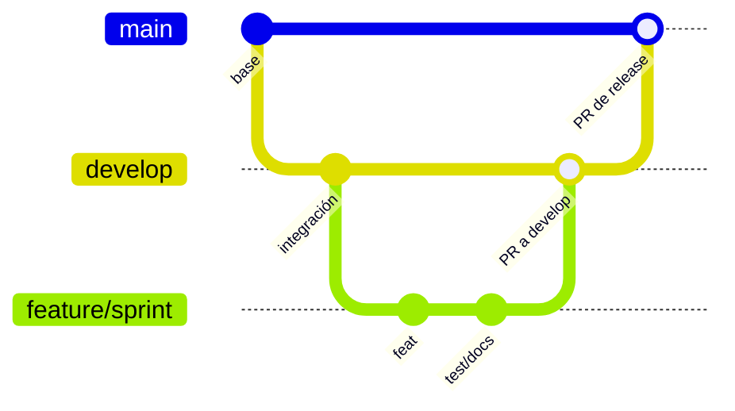

# Flujo de trabajo con Git

## 1. Modelo de ramas

El proyecto utiliza una variante académica de **Git Flow**:



| Tipo de rama | Propósito | Base | Destino |
|---|---|---|---|
| `main` | Versiones estables y entregables | - | - |
| `develop` | Integración continua de sprints | `main` inicialmente | `main` por release PR |
| `feature/SPRINTx-*` | Funcionalidad de un sprint | `develop` | `develop` |
| `fix/*` o `bugfix/*` | Corrección de defectos | `develop` | `develop` |
| `test/*` | Pruebas y automatización | `develop` | `develop` |
| `docs/*` | Documentación aislada | `develop` | `develop` |
| `chore/*` | Configuración y mantenimiento | `develop` | `develop` |

## 2. Convención de commits

Se utilizan commits semánticos en presente imperativo:

```text
<tipo>(<alcance>): <descripción>
```

Tipos principales:

- `feat`: funcionalidad.
- `fix`: corrección.
- `test`: pruebas.
- `docs`: documentación.
- `chore`: mantenimiento o configuración.
- `refactor`: cambio interno sin alterar comportamiento.
- `ci`: integración continua.

Ejemplos reales:

```text
feat(driver): add delivery assignment and realtime tracking
feat(tracking): connect driver and customer delivery flow
feat(orders): add order and simulated payment workflow
```

## 3. Proceso de Pull Request

1. Actualizar `develop` con `git pull --ff-only`.
2. Crear una rama desde `develop`.
3. Implementar cambios en commits pequeños y coherentes.
4. Ejecutar build, pruebas, lint y `git diff --check`.
5. Publicar la rama.
6. Abrir PR hacia `develop` con resumen, cambios, validación y fuera de alcance.
7. Revisar que no existan conflictos y que CI sea exitoso.
8. Integrar usando merge commit para conservar trazabilidad del sprint.
9. Crear PR de release `develop` hacia `main`.

## 4. Comandos de referencia

```bash
git switch develop
git pull --ff-only origin develop
git switch -c feature/SPRINT6-01-final-delivery

# trabajo y validación
git status --short --branch
git diff --check
git add -A
git commit -m "docs(project): add final rubric-aligned documentation"
git push -u origin feature/SPRINT6-01-final-delivery
```

## 5. Estrategia de integración

- Feature a `develop`: Pull Request con merge commit.
- `develop` a `main`: Pull Request de release.
- No se fuerza el historial de ramas compartidas.
- No se hace push directo a `main`.
- Las ramas de respaldo locales no forman parte del flujo de producción.

## 6. Evidencia del repositorio

| PR | Origen -> destino | Resultado |
|---:|---|---|
| #1 | `develop` -> `main` | Inicialización del monorepo |
| #2 | feature pública -> `develop` | Landing y acceso |
| #3 | `develop` -> `main` | Release v0.1 |
| #4 | feature cliente -> `develop` | Exploración y catálogo |
| #5 | feature cliente -> `develop` | Checkout, pedidos y tracking inicial |
| #6 | feature base de datos -> `develop` | MariaDB y migración inicial |
| #7 | `develop` -> `main` | Release v0.2 |
| #8 | feature autenticación -> `develop` | JWT, roles y cuenta |
| #9 | feature catálogo -> `develop` | Comercio e inventario |
| #10 | feature pedidos -> `develop` | Pedidos y pagos simulados |
| #11 | feature repartidor -> `develop` | Asignaciones, rutas y SignalR |
| SPRINT6 | feature final -> `develop` | CI y documentación final |
| Release final | `develop` -> `main` | Publicación del MVP completo |

## 7. Política para ramas concluidas

Una rama se considera concluida cuando su PR fue fusionado y no contiene trabajo pendiente. Puede conservarse temporalmente como evidencia, pero la fuente de verdad pasa a ser `develop` y posteriormente `main`. Las ramas antiguas no deben recibir nuevos commits.
